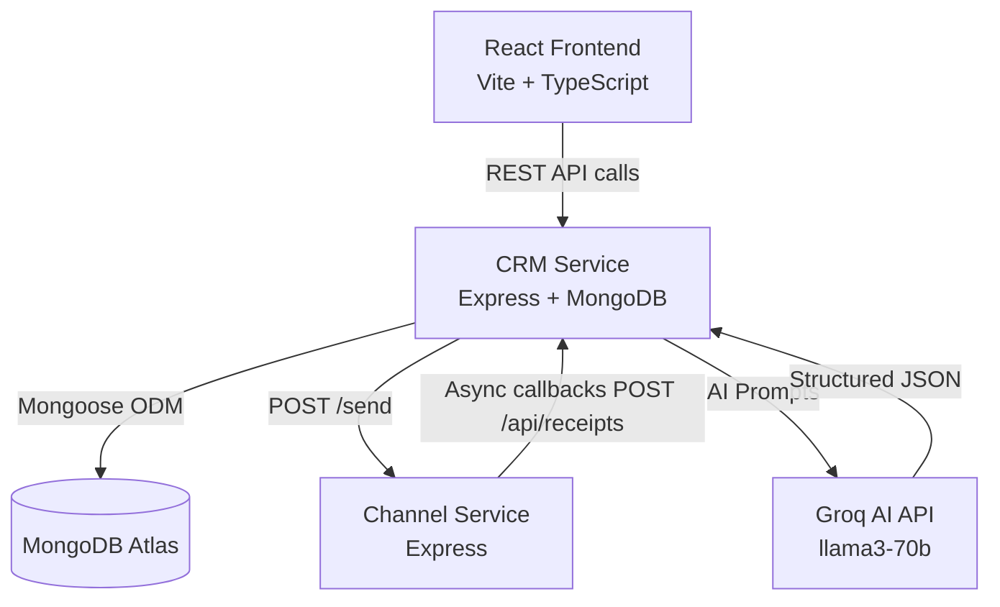

# Xeno Mini CRM

## Problem Statement
Traditional Customer Relationship Management (CRM) tools for retail brands are often bogged down by complex sales pipelines, support tickets, and leads administration. However, marketing professionals do not need to track deals or support cases; they need a specialized system to build target shopper cohorts, draft personalized outreach material, dispatch messages across modern networks (SMS, WhatsApp), and gather insights on campaign conversion rates.

Furthermore, building shopper cohorts in modern databases requires marketing executives to write structured SQL or MongoDB queries or depend on technical teams to extract target lists. This delay hampers the speed of marketing execution. The Xeno Mini CRM addresses these friction points by combining an AI-assisted natural language parser for database segment querying with a dedicated event callback architecture to simulate and monitor message status conversion flows.

## Live Demo
- Frontend: `http://localhost:5173`
- CRM Service: `http://localhost:5000`
- Channel Service: `http://localhost:6001`

## Architecture Diagram



## System Design
The system uses a decoupled, two-service backend architecture:
1. **CRM Service (Core)**: Serves the customer data registry, handles transactions, acts as the AI translator, and aggregates event counters. It delegates campaign delivery to the simulator.
2. **Channel Service (Simulator)**: Acts as an isolated message broker that mocks delivery outcomes. It responds immediately with a queue acknowledgement and starts an async event lifecycle simulation in the background, making callbacks to the CRM receipt webhook at random intervals.

By separating the core CRM from the high-throughput, delayed webhooks of the Channel Service, we ensure the CRM database is never locked during heavy outbound operations.

## Database Design

| Collection Name | Purpose | Key Fields |
| :--- | :--- | :--- |
| **customers** | Stores demographics and aggregated spend metrics | `name`, `email`, `phone`, `city`, `gender`, `lifetimeValue`, `lastPurchaseDate` |
| **orders** | Stores transaction records | `customerId`, `amount`, `category`, `orderDate`, `status` |
| **campaigns** | Stores marketing copy, target cohort criteria, and telemetry | `name`, `goal`, `audienceFilters`, `generatedMessage`, `status`, `sentCount`, `deliveredCount` |
| **communications** | Logs individual message status per campaign per shopper | `campaignId`, `customerId`, `channel`, `message`, `status`, `sentAt` |
| **communicationevents** | Tracks status lifecycle historical logs | `communicationId`, `campaignId`, `eventType`, `timestamp`, `metadata` |

## AI Features

### 1. Natural Language Audience Builder
The audience engine allows users to query customer cohorts in natural language. The prompt is sent to the Groq API (llama3-70b-8192), which outputs structured filters.
*   **Example Prompt**: *"Customers from Mumbai who spend over 10000 and haven't bought anything in 30 days"*
*   **Resolved JSON**:
    ```json
    {
      "city": "Mumbai",
      "minSpend": 10000,
      "inactiveDays": 30
    }
    ```

### 2. AI Campaign Generator
Generates personalized messages and recommends optimal delivery channels based on the marketing goal.
*   **Example Prompt**: *"Offer a 15% discount code on new Shoes to premium female customers"*
*   **Resolved JSON**:
    ```json
    {
      "name": "Step into Luxury",
      "channel": "WhatsApp",
      "message": "Hi {{name}}! Give your collection a refresh. Use shoes15 to get 15% off shoes today."
    }
    ```

### 3. Campaign Insights
Aggregates delivery logs (Delivered %, Open %, Click %, Conversion %) and passes them to the AI analyzer to highlight performance indicators and next-step actions.
*   **Output**: Includes a summary, bulleted findings (e.g., peak engagement times), and actionable list suggestions (e.g., target specific cities).

## Campaign Send Flow
1. **Audience Preview**: The marketer inputs target traits to find matching shoppers.
2. **Drafting Copy**: The marketer inputs goals and drafts copy.
3. **Saving Draft**: The campaign is saved in `draft` status in MongoDB.
4. **Outbound Dispatch**: The marketer clicks "Send". The CRM queries matching customers, records a `pending` Communication log for each, and triggers a `POST /send` request to the Channel Service.
5. **Acknowledge & Queue**: The Channel Service responds immediately with `{ success: true, message: "Queued" }`.
6. **Async Callbacks**: The Channel Service starts an async task that triggers delayed hooks (Sent -> Delivered -> Opened -> Read -> Clicked -> Converted) back to the CRM at `/api/receipts`.
7. **Real-time Refreshing**: The React frontend polls the CRM database every 5 seconds to update campaign metrics on the user's dashboard.

## Local Development Setup

### Prerequisite
1. MongoDB running locally or a MongoDB Atlas connection.
2. A Groq API Key (optional; fallbacks to local mocks if absent).

### Setup CRM Service
```bash
cd crm-service
npm install
# Rename .env.example to .env and fill in MONGODB_URI and GROQ_API_KEY
npm run dev
```

### Setup Channel Service
```bash
cd channel-service
npm install
# Rename .env.example to .env
npm run dev
```

### Setup Frontend
```bash
cd frontend
npm install
npm run dev
```

## Deployment

### Backend Services (Railway / Heroku)
1. Deploy `crm-service` and set the required environment variables: `MONGODB_URI`, `GROQ_API_KEY`, and `CHANNEL_SERVICE_URL`.
2. Deploy `channel-service` and point `CRM_SERVICE_URL` to your deployed CRM app url.

### Frontend Client (Vercel / Netlify)
Deploy `frontend` and configure `VITE_API_URL` pointing to your deployed CRM API gateway url.

## Tech Stack

| Tier | Technology |
| :--- | :--- |
| **Frontend** | React, Vite, TypeScript, Tailwind CSS, React Router v6, Recharts, Axios, Lucide |
| **Backend** | Node.js, Express, ts-node, Mongoose |
| **Database** | MongoDB |
| **AI / LLM** | Groq Client (llama3-70b-8192) |

## Tradeoffs & Decisions
1. **Simplified Cohorts**: To avoid complex joins, we store `lifetimeValue` directly on the customer record, updating it on order entry.
2. **Mock AI parser**: In the absence of a Groq key, we use regex parsing on the backend to extract filters, enabling instant evaluation.
3. **No Auth/Security**: This is a single-tenant mini CRM, meaning login and JWT checking are excluded to prioritize performance.

## Future Scalability
- **Message Queues**: Integrate **BullMQ** or **RabbitMQ** to control transaction loads under heavy lists.
- **Cache Layers**: Cache customer query preview results using **Redis**.
- **Real-time WebSockets**: Replace HTTP polling with **Socket.io** web sockets for callback logs.
- **Provider integrations**: Connect real provider webhooks (e.g. Twilio, Gupshup, SendGrid).
